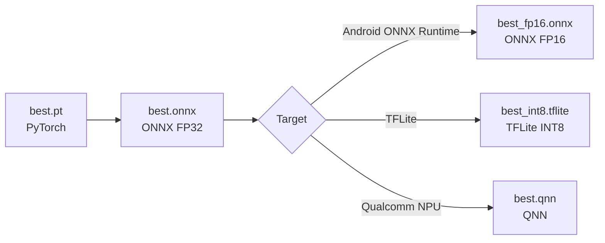

# YOLO Ball Detection — Hướng dẫn Fine-tune & Export cho HermiVision

> **Mục tiêu**: Fine-tune YOLO detect ball (tennis / pickleball) tại máy local, export sang ONNX để thay thế TrackNetV3 trong Android app HermiVision.

---

## Mục lục

1. [Tổng quan Architecture](#1-tổng-quan-architecture)
2. [Yêu cầu hệ thống](#2-yêu-cầu-hệ-thống)
3. [Cài đặt môi trường](#3-cài-đặt-môi-trường)
4. [Chuẩn bị Dataset](#4-chuẩn-bị-dataset)
5. [Cấu hình Training](#5-cấu-hình-training)
6. [Training Model](#6-training-model)
7. [Đánh giá Model](#7-đánh-giá-model)
8. [Export Model](#8-export-model)
9. [Tích hợp Android (HermiVision)](#9-tích-hợp-android-hermivision)
10. [Troubleshooting](#10-troubleshooting)

---

## 1. Tổng quan Architecture

### Hiện tại (TrackNetV3)

```
TrackNetV3.onnx (45MB) → 9 frames input → Heatmap output → Ball position
├── Ưu điểm: Temporal context (9 frames), tốt cho motion blur
├── Nhược điểm: Memory leak trên mobile, 500MB+ RAM, chậm
└── Model size: 45MB (FP32 ONNX)
```

### Mới (YOLO + ByteTrack)

```
YOLO-ball.onnx (~18MB INT8) → 1 frame input → Bounding box output → Ball position
├── Ưu điểm: Single-frame, không memory leak, ~100MB RAM, nhanh
├── Nhược điểm: Không có temporal context → bù bằng ByteTrack + Kalman
└── Model size: ~7MB (INT8 ONNX) hoặc ~18MB (FP16)
```

### Model được recommend

| Ưu tiên | Model | Lý do |
|---------|-------|-------|
| 🥇 1 | **YOLO26s** 🚀 | **Tốt nhất** — NMS-Free, STAL cho small object, edge-optimized, CPU nhanh hơn 43% |
| 🥈 2 | **YOLO26n** | Siêu nhẹ, nếu accuracy đủ |
| 🥉 3 | **YOLO11s** | Fallback stable nếu YOLO26 gặp issue |

> [!IMPORTANT]
> **YOLO26** đã release chính thức (14/01/2026) và tích hợp đầy đủ trong `ultralytics` package. Đây là lựa chọn tốt nhất cho HermiVision nhờ:
> - **NMS-Free (End-to-End)**: Không cần NMS post-processing → đơn giản code Android, giảm latency
> - **STAL (Small-Target-Aware Label Assignment)**: Detect ball nhỏ tốt hơn
> - **Loại bỏ DFL**: Dễ quantize INT8, chạy tốt trên NPU
> - **CPU inference nhanh hơn 43%** so với YOLO11

---

## 2. Yêu cầu hệ thống

### Phần cứng tối thiểu

| Component | Tối thiểu | Khuyến nghị |
|-----------|-----------|-------------|
| **GPU** | NVIDIA GTX 1660 (6GB VRAM) | RTX 3060+ (12GB VRAM) |
| **RAM** | 16GB | 32GB |
| **Disk** | 20GB trống | 50GB SSD |
| **CPU** | 4 cores | 8+ cores |

### Phần mềm

| Software | Version | Bắt buộc |
|----------|---------|----------|
| Python | 3.10 - 3.12 | ✅ |
| CUDA | 11.8 hoặc 12.x | ✅ (nếu dùng GPU) |
| cuDNN | 8.x+ | ✅ (nếu dùng GPU) |
| Git | Latest | ✅ |

> [!WARNING]
> Nếu không có GPU NVIDIA, vẫn có thể train trên CPU nhưng sẽ **rất chậm** (x10-x20 thời gian). Cân nhắc dùng Google Colab (free GPU T4) nếu máy không có GPU.

---

## 3. Cài đặt môi trường

### 3.1 Tạo Virtual Environment

```bash
# Tạo folder project
mkdir yolo-ball-detection
cd yolo-ball-detection

# Tạo virtual environment
python -m venv venv

# Activate (Windows)
venv\Scripts\activate

# Activate (Linux/Mac)
source venv/bin/activate
```

### 3.2 Cài đặt Dependencies

```bash
# Cài Ultralytics (bao gồm PyTorch, ONNX, v.v.)
pip install ultralytics

# Verify cài đặt
yolo checks

# Kiểm tra GPU
python -c "import torch; print(f'CUDA available: {torch.cuda.is_available()}'); print(f'GPU: {torch.cuda.get_device_name(0) if torch.cuda.is_available() else \"None\"}')"
```

### 3.3 Cài thêm công cụ hỗ trợ

```bash
# Roboflow CLI (download dataset)
pip install roboflow

# Label tool (nếu cần label thủ công)
pip install labelimg

# ONNX tools (cho export & verify)
pip install onnx onnxruntime onnxsim
```

### 3.4 Cấu trúc thư mục

```
yolo-ball-detection/
├── venv/
├── datasets/
│   └── ball/
│       ├── train/
│       │   ├── images/
│       │   └── labels/
│       ├── valid/
│       │   ├── images/
│       │   └── labels/
│       └── test/
│           ├── images/
│           └── labels/
├── configs/
│   └── ball_data.yaml
├── runs/                      # Ultralytics tự tạo khi train
│   └── detect/
│       └── train/
│           ├── weights/
│           │   ├── best.pt
│           │   └── last.pt
│           └── results.csv
├── exports/                   # Model đã export
│   ├── best.onnx
│   └── best_int8.onnx
└── scripts/
    ├── download_dataset.py
    ├── train.py
    ├── evaluate.py
    └── export.py
```

---

## 4. Chuẩn bị Dataset

### 4.1 Nguồn Dataset

| # | Nguồn | Dataset Name | Images | Chất lượng | Link |
|---|-------|-------------|--------|-----------|------|
| 1 | Roboflow | tennis-ball-detection (viren-dhanwani) v6 | ~530 | ⚠️ Trung bình | [Link](https://universe.roboflow.com/viren-dhanwani/tennis-ball-detection) |
| 2 | Roboflow | Search "tennis ball" | Varies | Varies | [Search](https://universe.roboflow.com/search?q=tennis+ball) |
| 3 | Roboflow | Search "pickleball" | Varies | Varies | [Search](https://universe.roboflow.com/search?q=pickleball) |
| 4 | Kaggle | Tennis ball datasets | Varies | Varies | [Search](https://www.kaggle.com/search?q=tennis+ball+detection) |
| 5 | **Custom** | **Quay từ thực tế** | **500+** | **✅ Tốt nhất** | N/A |

> [!IMPORTANT]
> **Mục tiêu: Ít nhất 2000+ images** cho dataset cuối cùng. Repo tennis_analysis chỉ dùng ~530 images → Recall chỉ 52.5%. Cần nhiều hơn để đạt Recall > 80%.

### 4.2 Download Dataset từ Roboflow

Tạo file `scripts/download_dataset.py`:

```python
"""
Download ball detection dataset từ Roboflow.

Yêu cầu:
    1. Tạo account Roboflow (free): https://roboflow.com
    2. Lấy API key từ: https://app.roboflow.com/settings/api
    3. Set environment variable: ROBOFLOW_API_KEY=your_key_here
"""
import os
from roboflow import Roboflow

# ============================================================
# CẤU HÌNH - Thay đổi các giá trị này theo dataset bạn muốn
# ============================================================
ROBOFLOW_API_KEY = os.environ.get("ROBOFLOW_API_KEY", "YOUR_API_KEY")
WORKSPACE = "viren-dhanwani"         # Tên workspace trên Roboflow
PROJECT = "tennis-ball-detection"    # Tên project
VERSION = 6                          # Version dataset
EXPORT_FORMAT = "yolov8"             # Format cho Ultralytics YOLO
DOWNLOAD_DIR = "./datasets/ball"     # Thư mục lưu dataset

def main():
    rf = Roboflow(api_key=ROBOFLOW_API_KEY)
    project = rf.workspace(WORKSPACE).project(PROJECT)
    version = project.version(VERSION)

    print(f"Downloading dataset: {PROJECT} v{VERSION}")
    print(f"Format: {EXPORT_FORMAT}")
    print(f"Destination: {DOWNLOAD_DIR}")

    dataset = version.download(EXPORT_FORMAT, location=DOWNLOAD_DIR)
    print(f"\n✅ Dataset downloaded to: {dataset.location}")
    print(f"   Train images: {DOWNLOAD_DIR}/train/images/")
    print(f"   Valid images: {DOWNLOAD_DIR}/valid/images/")

if __name__ == "__main__":
    main()
```

```bash
# Chạy download
set ROBOFLOW_API_KEY=your_key_here
python scripts/download_dataset.py
```

### 4.3 Label Format (YOLO Format)

Mỗi image có 1 file `.txt` tương ứng trong folder `labels/`:

```
# Format mỗi dòng: <class_id> <x_center> <y_center> <width> <height>
# Tất cả giá trị normalized [0, 1] relative to image size

# Ví dụ: ball ở giữa frame, size nhỏ
0 0.534 0.421 0.025 0.035
```

- `class_id`: Luôn là `0` (vì chỉ có 1 class: `ball`)
- `x_center, y_center`: Tâm bounding box (normalized)
- `width, height`: Kích thước bounding box (normalized)

### 4.4 Tạo Custom Dataset từ Video thực tế

Đây là bước **QUAN TRỌNG NHẤT** để đạt accuracy cao trên app HermiVision:

```bash
# Bước 1: Extract frames từ video match thực tế
# (Từ videos quay bằng chính app hoặc camera phone)
python scripts/extract_frames.py
```

Tạo file `scripts/extract_frames.py`:

```python
"""
Extract frames từ video để label.
Tự động bỏ qua frames giống nhau (dedup).
"""
import cv2
import os
import numpy as np

VIDEO_PATH = "path/to/your/match_video.mp4"
OUTPUT_DIR = "./datasets/ball/custom_frames"
FRAME_INTERVAL = 5  # Lấy mỗi 5 frames (giảm redundancy)

def main():
    os.makedirs(OUTPUT_DIR, exist_ok=True)
    cap = cv2.VideoCapture(VIDEO_PATH)
    
    frame_count = 0
    saved_count = 0
    prev_frame = None
    
    while True:
        ret, frame = cap.read()
        if not ret:
            break
        
        frame_count += 1
        if frame_count % FRAME_INTERVAL != 0:
            continue
        
        # Simple dedup: skip nếu frame quá giống frame trước
        if prev_frame is not None:
            diff = np.mean(np.abs(frame.astype(float) - prev_frame.astype(float)))
            if diff < 5.0:  # Threshold cho sự khác biệt
                continue
        
        filename = f"frame_{frame_count:06d}.jpg"
        cv2.imwrite(os.path.join(OUTPUT_DIR, filename), frame)
        saved_count += 1
        prev_frame = frame.copy()
    
    cap.release()
    print(f"✅ Extracted {saved_count} unique frames from {frame_count} total frames")
    print(f"   Saved to: {OUTPUT_DIR}")

if __name__ == "__main__":
    main()
```

```bash
# Bước 2: Label bằng LabelImg hoặc Roboflow Annotate
labelimg ./datasets/ball/custom_frames --autosave

# Trong LabelImg:
# 1. Change save format → YOLO
# 2. Tạo class "ball"  
# 3. Draw bounding box quanh ball mỗi frame
# 4. Save (Ctrl+S)
# 5. Next image (D key)
```

> [!TIP]
> **Roboflow Annotate** (web-based) nhanh hơn LabelImg cho batch labeling. Upload images lên Roboflow → Label online → Export YOLO format.

### 4.5 Merge Multiple Datasets

```python
"""
Merge nhiều YOLO datasets thành 1 dataset duy nhất.
"""
import os
import shutil
import random

DATASETS = [
    "./datasets/ball/roboflow_tennis",
    "./datasets/ball/roboflow_pickleball",
    "./datasets/ball/custom_frames_labeled",
]
OUTPUT = "./datasets/ball_merged"

def merge_datasets():
    for split in ["train", "valid", "test"]:
        img_dir = os.path.join(OUTPUT, split, "images")
        lbl_dir = os.path.join(OUTPUT, split, "labels")
        os.makedirs(img_dir, exist_ok=True)
        os.makedirs(lbl_dir, exist_ok=True)
    
    counter = 0
    for ds_path in DATASETS:
        for split in ["train", "valid", "test"]:
            src_img = os.path.join(ds_path, split, "images")
            src_lbl = os.path.join(ds_path, split, "labels")
            
            if not os.path.exists(src_img):
                continue
            
            for img_file in os.listdir(src_img):
                ext = os.path.splitext(img_file)[1]
                if ext.lower() not in [".jpg", ".jpeg", ".png"]:
                    continue
                
                new_name = f"ball_{counter:06d}"
                counter += 1
                
                # Copy image
                shutil.copy2(
                    os.path.join(src_img, img_file),
                    os.path.join(OUTPUT, split, "images", new_name + ext)
                )
                
                # Copy label
                lbl_file = os.path.splitext(img_file)[0] + ".txt"
                lbl_src = os.path.join(src_lbl, lbl_file)
                if os.path.exists(lbl_src):
                    shutil.copy2(
                        lbl_src,
                        os.path.join(OUTPUT, split, "labels", new_name + ".txt")
                    )
    
    # Print stats
    for split in ["train", "valid", "test"]:
        img_dir = os.path.join(OUTPUT, split, "images")
        count = len(os.listdir(img_dir)) if os.path.exists(img_dir) else 0
        print(f"  {split}: {count} images")
    
    print(f"\n✅ Merged {counter} images → {OUTPUT}")

if __name__ == "__main__":
    merge_datasets()
```

### 4.6 Thêm Negative Samples

> [!IMPORTANT]
> **Negative samples** (ảnh KHÔNG có ball) rất quan trọng để giảm false positives. Thêm 10-20% negative samples vào dataset.

```python
"""
Thêm negative samples (frames không có ball).
Chỉ cần tạo file .txt trống (không có annotation) cho mỗi ảnh.
"""
import os

NEGATIVE_IMAGES_DIR = "./datasets/ball/negatives/images"
OUTPUT_LABELS_DIR = "./datasets/ball_merged/train/labels"
OUTPUT_IMAGES_DIR = "./datasets/ball_merged/train/images"

# Copy negative images và tạo empty labels
for img in os.listdir(NEGATIVE_IMAGES_DIR):
    if not img.endswith(('.jpg', '.png', '.jpeg')):
        continue
    
    # Copy image
    shutil.copy2(
        os.path.join(NEGATIVE_IMAGES_DIR, img),
        os.path.join(OUTPUT_IMAGES_DIR, f"neg_{img}")
    )
    
    # Tạo empty label file
    label_name = f"neg_{os.path.splitext(img)[0]}.txt"
    open(os.path.join(OUTPUT_LABELS_DIR, label_name), 'w').close()
```

---

## 5. Cấu hình Training

### 5.1 Data Config

Tạo file `configs/ball_data.yaml`:

```yaml
# ============================================================
# Ball Detection Dataset Config
# ============================================================
# Dùng cho fine-tune YOLO detect tennis ball / pickleball
# ============================================================

path: ../datasets/ball_merged   # Path relative to nơi chạy lệnh train
                                 # Hoặc dùng absolute path
train: train/images
val: valid/images
test: test/images               # Optional

# Classes
nc: 1                           # Số lượng class: chỉ 1 class "ball"
names:
  0: ball                       # tennis ball + pickleball chung 1 class
```

### 5.2 Training Hyperparameters

Tạo file `scripts/train.py`:

```python
"""
Fine-tune YOLO26 cho ball detection.

Model Variants:
    - yolo26n.pt  →  Nano  (~2.6M params) — Nhanh, accuracy thấp hơn
    - yolo26s.pt  →  Small (~9.4M params) — RECOMMENDED: balance speed/accuracy
    - yolo26m.pt  →  Medium (~20M params) — Chậm trên mobile, accuracy cao

YOLO26 Advantages:
    - NMS-Free: End-to-End inference, không cần NMS post-processing
    - STAL: Small-Target-Aware Label Assignment → tốt cho ball detection
    - 43% faster CPU inference so với YOLO11
    - Loại bỏ DFL → dễ quantize INT8 cho mobile

Usage:
    python scripts/train.py
    python scripts/train.py --model yolo26n.pt --epochs 300
"""

import argparse
from ultralytics import YOLO


def parse_args():
    parser = argparse.ArgumentParser(description="Fine-tune YOLO for ball detection")
    parser.add_argument("--model", type=str, default="yolo26s.pt",
                        help="Pre-trained model: yolo26n.pt, yolo26s.pt, yolo26m.pt")
    parser.add_argument("--data", type=str, default="configs/ball_data.yaml",
                        help="Path to data config YAML")
    parser.add_argument("--epochs", type=int, default=200,
                        help="Number of training epochs")
    parser.add_argument("--imgsz", type=int, default=640,
                        help="Image size (GIỮU 640, KHÔNG giảm)")
    parser.add_argument("--batch", type=int, default=16,
                        help="Batch size (-1 for auto)")
    parser.add_argument("--device", type=str, default="0",
                        help="Device: 0 (GPU), cpu")
    parser.add_argument("--resume", action="store_true",
                        help="Resume training from last checkpoint")
    return parser.parse_args()


def main():
    args = parse_args()
    
    # ====================================================
    # Load pretrained model
    # ====================================================
    if args.resume:
        # Resume từ last.pt
        model = YOLO("runs/detect/train/weights/last.pt")
        print("🔄 Resuming training from last checkpoint...")
    else:
        model = YOLO(args.model)
        print(f"📦 Loading pretrained model: {args.model}")
    
    # ====================================================
    # Training Configuration
    # ====================================================
    results = model.train(
        data=args.data,
        epochs=args.epochs,
        imgsz=args.imgsz,
        batch=args.batch,
        device=args.device,
        
        # =============================================
        # QUAN TRỌNG: Augmentation cho Small Objects
        # =============================================
        augment=True,
        mosaic=1.0,          # Mosaic augmentation (ghép 4 ảnh → 1)
        mixup=0.1,           # MixUp augmentation (trộn 2 ảnh)
        scale=0.9,           # Random scale ±90%
        fliplr=0.5,          # Horizontal flip 50%
        flipud=0.0,          # Vertical flip OFF (ball physics is directional)
        hsv_h=0.015,         # Hue augmentation
        hsv_s=0.7,           # Saturation augmentation
        hsv_v=0.4,           # Value (brightness) augmentation
        translate=0.1,       # Random translate ±10%
        degrees=0.0,         # Rotation OFF (bounding box không rotate tốt)
        
        # =============================================
        # Optimizer
        # =============================================
        optimizer="AdamW",   # AdamW tốt hơn SGD cho fine-tune
        lr0=0.001,           # Initial learning rate
        lrf=0.01,            # Final LR = lr0 * lrf
        weight_decay=0.0005, # L2 regularization
        warmup_epochs=3,     # Warmup iterations
        
        # =============================================
        # Early Stopping & Saving
        # =============================================
        patience=30,         # Stop sau 30 epochs không cải thiện
        save=True,           # Save checkpoints
        save_period=10,      # Save mỗi 10 epochs
        
        # =============================================
        # Performance
        # =============================================
        workers=8,           # DataLoader workers
        amp=True,            # Mixed precision (FP16) training — nhanh hơn ~2x
        cache=True,          # Cache images in RAM (cần đủ RAM)
        
        # =============================================
        # Logging
        # =============================================
        verbose=True,
        plots=True,          # Tạo biểu đồ P/R/F1/loss curves
        
        # =============================================
        # Multi-scale Training (optional, cần nhiều GPU RAM)
        # =============================================
        # rect=False,        # Rectangular training OFF for multi-scale
        # multi_scale=True,  # Random resize mỗi batch (±50%)
    )
    
    # ====================================================
    # In kết quả
    # ====================================================
    print("\n" + "=" * 60)
    print("✅ TRAINING COMPLETED!")
    print("=" * 60)
    print(f"Best model saved: runs/detect/train/weights/best.pt")
    print(f"Last model saved: runs/detect/train/weights/last.pt")
    print(f"Training logs:    runs/detect/train/")
    print(f"\nMetrics:")
    print(f"  mAP50:    {results.results_dict.get('metrics/mAP50(B)', 'N/A')}")
    print(f"  mAP50-95: {results.results_dict.get('metrics/mAP50-95(B)', 'N/A')}")
    print(f"  Precision:{results.results_dict.get('metrics/precision(B)', 'N/A')}")
    print(f"  Recall:   {results.results_dict.get('metrics/recall(B)', 'N/A')}")


if __name__ == "__main__":
    main()
```

### 5.3 Giải thích quyết định Training

| Parameter | Giá trị | Lý do |
|-----------|---------|-------|
| `imgsz=640` | 640 | **KHÔNG giảm**. Ball rất nhỏ, giảm resolution = mất ball |
| `mosaic=1.0` | 100% | Ghép 4 ảnh → 1 frame, tăng diversity |
| `mixup=0.1` | 10% | Nhẹ nhàng, tránh blur quá nhiều |
| `scale=0.9` | ±90% | Ball xuất hiện ở nhiều khoảng cách khác nhau |
| `flipud=0.0` | OFF | Ball physics có hướng (trên/dưới có ý nghĩa) |
| `degrees=0.0` | OFF | Bounding box không xoay, rotate gây artifacts |
| `optimizer=AdamW` | AdamW | Tốt hơn SGD cho fine-tune (convergence nhanh hơn) |
| `patience=30` | 30 epochs | Đủ thời gian cho model cải thiện, tránh overfit |
| `amp=True` | Mixed precision | Nhanh ~2x, không ảnh hưởng accuracy |

---

## 6. Training Model

### 6.1 Bắt đầu Training

```bash
# Cách 1: Chạy script Python (mặc định dùng yolo26s.pt)
python scripts/train.py

# Cách 2: Chạy script Python với custom args
python scripts/train.py --model yolo26s.pt --epochs 300 --batch 16

# Cách 3: Dùng Ultralytics CLI trực tiếp
yolo detect train \
    model=yolo26s.pt \
    data=configs/ball_data.yaml \
    epochs=200 \
    imgsz=640 \
    batch=16 \
    device=0
```

### 6.2 Monitor Training

```bash
# Xem training progress real-time bằng TensorBoard
tensorboard --logdir runs/detect/train

# Hoặc xem file CSV
# runs/detect/train/results.csv chứa metrics mỗi epoch
```

### 6.3 Resume Training (nếu bị gián đoạn)

```bash
# Resume từ last checkpoint
python scripts/train.py --resume

# Hoặc CLI
yolo detect train resume model=runs/detect/train/weights/last.pt
```

### 6.4 Kết quả mong đợi

Sau khi train xong, kiểm tra các file trong `runs/detect/train/`:

```
runs/detect/train/
├── weights/
│   ├── best.pt              ← Model tốt nhất (dùng cho export)
│   └── last.pt              ← Checkpoint cuối
├── results.csv              ← Metrics mỗi epoch
├── results.png              ← Biểu đồ loss/metrics
├── confusion_matrix.png     ← Ma trận nhầm lẫn
├── F1_curve.png             ← F1 score theo confidence
├── P_curve.png              ← Precision curve
├── R_curve.png              ← Recall curve
├── PR_curve.png             ← Precision-Recall curve
├── val_batch0_pred.jpg      ← Predictions trên validation
└── val_batch0_labels.jpg    ← Ground truth labels
```

### 6.5 Target Metrics

| Metric | Mục tiêu tối thiểu | Mục tiêu tốt | Ghi chú |
|--------|-------------------|----------------|---------|
| **mAP50** | > 0.80 | > 0.90 | Metric chính cho ball detection |
| **mAP50-95** | > 0.50 | > 0.65 | Strict metric |
| **Precision** | > 0.85 | > 0.92 | Giảm false positive |
| **Recall** | > 0.75 | > 0.85 | Detect được nhiều ball |

> [!WARNING]
> Nếu **Recall < 0.70**, model bỏ lỡ quá nhiều ball. Cần:
> 1. Thêm data (đặc biệt data thực tế từ phone)
> 2. Giảm confidence threshold khi inference
> 3. Tăng epochs hoặc dùng model lớn hơn (yolo26m)

---

## 7. Đánh giá Model

### 7.1 Validation

```bash
# Validate trên validation set
yolo detect val \
    model=runs/detect/train/weights/best.pt \
    data=configs/ball_data.yaml \
    imgsz=640 \
    device=0
```

### 7.2 Test trên Video

Tạo file `scripts/evaluate.py`:

```python
"""
Đánh giá model trên video thực tế.
Visualize detections + lưu video output.
"""
from ultralytics import YOLO
import cv2

MODEL_PATH = "runs/detect/train/weights/best.pt"
VIDEO_PATH = "path/to/test_match.mp4"
OUTPUT_PATH = "runs/detect/test_output.mp4"
CONF_THRESHOLD = 0.25

def main():
    model = YOLO(MODEL_PATH)
    
    # Inference trên video
    results = model.predict(
        source=VIDEO_PATH,
        conf=CONF_THRESHOLD,
        imgsz=640,
        save=True,           # Lưu video annotated
        save_txt=True,       # Lưu detections ra text
        show=False,          # Không hiện window
        stream=True,         # Stream mode cho video dài
    )
    
    # Đếm statistics
    total_frames = 0
    detected_frames = 0
    confidences = []
    
    for r in results:
        total_frames += 1
        if len(r.boxes) > 0:
            detected_frames += 1
            for box in r.boxes:
                confidences.append(float(box.conf[0]))
    
    # Print report
    print("\n" + "=" * 60)
    print("📊 EVALUATION REPORT")
    print("=" * 60)
    print(f"Total frames:    {total_frames}")
    print(f"Detected frames: {detected_frames}")
    print(f"Detection rate:  {detected_frames/total_frames*100:.1f}%")
    if confidences:
        print(f"Avg confidence:  {sum(confidences)/len(confidences):.3f}")
        print(f"Min confidence:  {min(confidences):.3f}")
        print(f"Max confidence:  {max(confidences):.3f}")
    print(f"\nAnnotated video saved to: runs/detect/predict/")

if __name__ == "__main__":
    main()
```

### 7.3 So sánh với TrackNetV3

```python
"""
So sánh kết quả YOLO vs TrackNet trên cùng video.
Cần có ground truth labels.
"""
from ultralytics import YOLO
import json

def compare_models():
    model = YOLO("runs/detect/train/weights/best.pt")
    
    # Test speed
    import time
    
    # Single frame benchmark
    img = "path/to/test_frame.jpg"
    
    # Warm up
    for _ in range(5):
        model.predict(img, verbose=False)
    
    # Benchmark
    times = []
    for _ in range(100):
        start = time.time()
        model.predict(img, verbose=False)
        times.append(time.time() - start)
    
    avg_time = sum(times) / len(times) * 1000  # ms
    print(f"\n⏱️  YOLO Inference Speed:")
    print(f"   Average: {avg_time:.1f} ms/frame")
    print(f"   FPS:     {1000/avg_time:.0f}")
    
    print(f"\n📊 So sánh (reference):")
    print(f"   TrackNetV3 trên mobile: ~200-500 ms/frame (9 frames input)")
    print(f"   YOLO trên mobile (INT8): ~15-50 ms/frame (dự kiến)")

if __name__ == "__main__":
    compare_models()
```

---

## 8. Export Model

### 8.1 Export Pipeline



### 8.2 Export Script

Tạo file `scripts/export.py`:

```python
"""
Export fine-tuned YOLO model sang các format cho mobile deployment.

Formats:
    1. ONNX FP32      — Debug & verify
    2. ONNX FP16      — RECOMMENDED cho Android + ONNX Runtime
    3. TFLite FP16     — Backup cho TFLite delegate
    4. TFLite INT8     — Nhỏ nhất, nhanh nhất (cần calibration data)

Usage:
    python scripts/export.py
    python scripts/export.py --format onnx --half
    python scripts/export.py --format tflite --int8
"""

import argparse
import os
from ultralytics import YOLO


def parse_args():
    parser = argparse.ArgumentParser(description="Export YOLO model")
    parser.add_argument("--model", type=str, 
                        default="runs/detect/train/weights/best.pt",
                        help="Path to trained model")
    parser.add_argument("--format", type=str, default="onnx",
                        choices=["onnx", "tflite", "all"],
                        help="Export format")
    parser.add_argument("--half", action="store_true",
                        help="Export FP16 (half precision)")
    parser.add_argument("--int8", action="store_true",
                        help="Export INT8 (requires calibration data)")
    parser.add_argument("--imgsz", type=int, default=640,
                        help="Image size for export")
    parser.add_argument("--simplify", action="store_true", default=True,
                        help="Simplify ONNX graph")
    parser.add_argument("--opset", type=int, default=17,
                        help="ONNX opset version")
    parser.add_argument("--nms", action="store_true", default=False,
                        help="Include NMS in ONNX model")
    parser.add_argument("--output-dir", type=str, default="exports",
                        help="Output directory")
    return parser.parse_args()


def export_onnx(model, args):
    """Export sang ONNX format."""
    print("\n📦 Exporting ONNX...")
    
    exported = model.export(
        format="onnx",
        imgsz=args.imgsz,
        half=args.half,          # FP16 nếu --half
        simplify=args.simplify,  # Simplify graph (loại bỏ redundant ops)
        opset=args.opset,        # ONNX opset version
        dynamic=False,           # Static shape cho mobile (tốt hơn)
        nms=args.nms,            # Include NMS trong model graph
    )
    
    print(f"✅ ONNX exported: {exported}")
    
    # Verify exported model
    import onnx
    onnx_model = onnx.load(exported)
    onnx.checker.check_model(onnx_model)
    print(f"✅ ONNX model verified successfully")
    
    # Print model info
    file_size = os.path.getsize(exported) / (1024 * 1024)
    print(f"   Size: {file_size:.1f} MB")
    print(f"   Inputs: {[i.name for i in onnx_model.graph.input]}")
    print(f"   Outputs: {[o.name for o in onnx_model.graph.output]}")
    
    # Test inference với ONNX Runtime
    import onnxruntime as ort
    import numpy as np
    
    sess = ort.InferenceSession(exported)
    input_name = sess.get_inputs()[0].name
    input_shape = sess.get_inputs()[0].shape
    print(f"   Input shape: {input_shape}")
    
    # Dummy inference
    dummy = np.random.randn(*[1, 3, args.imgsz, args.imgsz]).astype(np.float32)
    if args.half:
        dummy = dummy.astype(np.float16)
    output = sess.run(None, {input_name: dummy})
    print(f"   Output shapes: {[o.shape for o in output]}")
    
    return exported


def export_tflite(model, args):
    """Export sang TFLite format."""
    print("\n📦 Exporting TFLite...")
    
    exported = model.export(
        format="tflite",
        imgsz=args.imgsz,
        half=args.half,
        int8=args.int8,
    )
    
    print(f"✅ TFLite exported: {exported}")
    file_size = os.path.getsize(exported) / (1024 * 1024)
    print(f"   Size: {file_size:.1f} MB")
    
    return exported


def main():
    args = parse_args()
    
    # Load model
    model = YOLO(args.model)
    print(f"📦 Loaded model: {args.model}")
    
    # Create output directory
    os.makedirs(args.output_dir, exist_ok=True)
    
    exported_files = []
    
    if args.format in ["onnx", "all"]:
        exported_files.append(export_onnx(model, args))
    
    if args.format in ["tflite", "all"]:
        exported_files.append(export_tflite(model, args))
    
    # Summary
    print("\n" + "=" * 60)
    print("✅ EXPORT COMPLETED!")
    print("=" * 60)
    for f in exported_files:
        size = os.path.getsize(f) / (1024 * 1024)
        print(f"  📄 {f} ({size:.1f} MB)")
    
    print(f"\n📋 Next Steps:")
    print(f"  1. Copy ONNX file vào HermiVision project:")
    print(f"     cp {exported_files[0]} /path/to/Hermi-Vision/assets/models/YoloBall.onnx")
    print(f"  2. Tạo YoloBallInferencer.kt trong Android project")
    print(f"  3. Thay thế TrackNetInferencer bằng YoloBallInferencer")


if __name__ == "__main__":
    main()
```

### 8.3 Chạy Export

```bash
# =============================================
# RECOMMENDED: ONNX FP16 (cho ONNX Runtime Android)
# =============================================
python scripts/export.py --format onnx --half

# Hoặc CLI:
yolo export model=runs/detect/train/weights/best.pt format=onnx half=True simplify=True imgsz=640

# =============================================
# Alternative: ONNX FP32 (để debug)
# =============================================
python scripts/export.py --format onnx

# =============================================
# Alternative: TFLite INT8 (nhỏ nhất, nhanh nhất)
# =============================================
python scripts/export.py --format tflite --int8

# =============================================
# Export tất cả formats
# =============================================
python scripts/export.py --format all --half
```

### 8.4 Kiểm tra Output Shape ONNX

> [!IMPORTANT]
> Hiểu output shape của ONNX model là **bắt buộc** trước khi viết code Android.

```python
"""
Inspect ONNX model input/output shape.
Chạy trước khi tích hợp Android.
"""
import onnxruntime as ort
import numpy as np

MODEL_PATH = "runs/detect/train/weights/best.onnx"

sess = ort.InferenceSession(MODEL_PATH)

print("=== INPUT ===")
for inp in sess.get_inputs():
    print(f"  Name: {inp.name}")
    print(f"  Shape: {inp.shape}")
    print(f"  Type: {inp.type}")

print("\n=== OUTPUT ===")
for out in sess.get_outputs():
    print(f"  Name: {out.name}")
    print(f"  Shape: {out.shape}")
    print(f"  Type: {out.type}")

# Dummy inference
input_name = sess.get_inputs()[0].name
dummy = np.random.randn(1, 3, 640, 640).astype(np.float32)
outputs = sess.run(None, {input_name: dummy})

print("\n=== ACTUAL OUTPUT SHAPES ===")
for i, out in enumerate(outputs):
    print(f"  Output[{i}]: shape={out.shape}, dtype={out.dtype}")
    print(f"  Sample values: {out.flatten()[:5]}")
```

**YOLO26 output format:**

```
Input:  [1, 3, 640, 640]    # BCHW, normalized [0,1]
Output: [1, 5, 8400]        # [batch, (x,y,w,h,conf), num_detections]
                             # Hoặc [1, 5+nc, 8400] nếu nc > 1

Trong đó:
  - x, y: center position (pixel, relative to 640x640)
  - w, h: width, height (pixel)
  - conf: confidence score cho class "ball"
  - 8400: tổng số anchors/grid cells
```

> [!NOTE]
> **YOLO26 là NMS-Free** — output đã được lọc sẵn, KHÔNG cần áp dụng NMS post-processing. Tuy nhiên nếu export ONNX mặc định (không bật `nms=True`), output raw vẫn cần transpose `[1, 5, 8400]` → `[8400, 5]` rồi lọc theo confidence. Kiểm tra output shape thực tế bằng `inspect_onnx.py`.

### 8.5 Copy Model vào HermiVision

```bash
# Copy ONNX model vào Android project
copy runs\detect\train\weights\best.onnx D:\Hermi-Vision\assets\models\YoloBall.onnx
```

---

## 9. Tích hợp Android (HermiVision)

### 9.1 Tổng quan thay đổi

```
Cần thay đổi / tạo mới:
├── assets/models/
│   ├── TrackNetV3-final.onnx      ← XÓA hoặc để lại (optional)
│   └── YoloBall.onnx              ← MỚI: YOLO fine-tuned model
├── domain/inference/
│   ├── TrackNetInferencer.kt      ← GIỮ NGUYÊN (tạm thời, để A/B test)
│   ├── YoloBallInferencer.kt      ← MỚI: YOLO inference engine
│   └── BallTracker.kt             ← MỚI: ByteTrack-style tracker
└── data/model/
    └── DataModels.kt              ← SỬA: thêm BallDetection data class
```

### 9.2 YoloBallInferencer (Kotlin Draft)

```kotlin
package com.hermitech.hermivision.domain.inference

import ai.onnxruntime.OnnxTensor
import ai.onnxruntime.OrtSession
import com.hermitech.hermivision.data.model.BallFrame
import java.nio.FloatBuffer
import kotlin.math.max
import kotlin.math.min
import kotlinx.coroutines.channels.ReceiveChannel
import org.opencv.core.CvType
import org.opencv.core.Mat
import org.opencv.imgproc.Imgproc

/**
 * YOLO26-based ball detector.
 * Replaces TrackNetV3 — single frame input, bounding box output.
 *
 * YOLO26 advantages: NMS-Free, STAL (small-target-aware), 43% faster CPU.
 *
 * Pipeline:
 *   1. Preprocess: resize 640x640, normalize [0,1], CHW layout
 *   2. ONNX inference: output [1, 5, 8400]
 *   3. Post-process: filter by confidence (NMS-Free nên không cần NMS)
 *   4. Return BallFrame (same interface as TrackNet)
 */
class YoloBallInferencer(private val sessionManager: OnnxSessionManager) {

    companion object {
        private const val ASSET_MODEL_NAME = "YoloBall.onnx"
        private const val INPUT_SIZE = 640
        private const val CONF_THRESHOLD = 0.25f
        private const val IOU_THRESHOLD = 0.45f
        private const val MAX_DETECTIONS = 10
    }

    private var session: OrtSession? = null
    private val inputBuffer = FloatBuffer.allocate(1 * 3 * INPUT_SIZE * INPUT_SIZE)

    fun loadModel() {
        session = sessionManager.loadSession(ASSET_MODEL_NAME)
    }

    fun releaseModel() {
        session?.close()
        session = null
    }

    /**
     * Inference from decoded frame channel.
     * Interface tương thích với TrackNetInferencer.inferFromChannel().
     */
    suspend fun inferFromChannel(
        inputChannel: ReceiveChannel<Mat>,
        origWidth: Int,
        origHeight: Int,
        onProgress: (Int) -> Unit = {}
    ): List<BallFrame> {
        val sess = session
            ?: throw IllegalStateException("Model not loaded. Call loadModel() first.")
        
        val results = ArrayList<BallFrame>()
        var frameId = 0

        for (mat in inputChannel) {
            val ballFrame = detectSingleFrame(sess, mat, frameId, origWidth, origHeight)
            results.add(ballFrame)
            mat.release()
            
            frameId++
            onProgress(frameId)
        }

        return results
    }

    /**
     * Detect ball in a single frame.
     */
    private fun detectSingleFrame(
        sess: OrtSession,
        mat: Mat,
        frameId: Int,
        origWidth: Int,
        origHeight: Int
    ): BallFrame {
        // 1. Preprocess: resize + normalize + CHW
        val resized = Mat()
        Imgproc.resize(mat, resized, org.opencv.core.Size(
            INPUT_SIZE.toDouble(), INPUT_SIZE.toDouble()
        ))

        val floatMat = Mat()
        resized.convertTo(floatMat, CvType.CV_32FC3, 1.0 / 255.0)
        resized.release()

        // Extract RGB channels in CHW order
        val channels = ArrayList<Mat>(3)
        org.opencv.core.Core.split(floatMat, channels)
        floatMat.release()

        inputBuffer.rewind()
        val tempArray = FloatArray(INPUT_SIZE * INPUT_SIZE)
        for (c in 0 until 3) {
            channels[c].get(0, 0, tempArray)
            inputBuffer.put(tempArray)
            channels[c].release()
        }
        inputBuffer.rewind()

        // 2. Run ONNX inference
        val shape = longArrayOf(1, 3, INPUT_SIZE.toLong(), INPUT_SIZE.toLong())
        OnnxTensor.createTensor(sessionManager.env, inputBuffer, shape).use { inputTensor ->
            sess.run(mapOf("images" to inputTensor)).use { result ->
                val output = result[0].value

                // 3. Post-process
                return parseYoloOutput(output, frameId, origWidth, origHeight)
            }
        }
    }

    /**
     * Parse YOLO output [1, 5, 8400] → best ball detection.
     *
     * Output format: [batch, (cx, cy, w, h, conf_ball), num_anchors]
     */
    @Suppress("UNCHECKED_CAST")
    private fun parseYoloOutput(
        output: Any,
        frameId: Int,
        origWidth: Int,
        origHeight: Int
    ): BallFrame {
        // Output shape: [1, 5, 8400] → flatten to [5, 8400]
        val rawData: Array<FloatArray> = when (output) {
            is Array<*> -> {
                val batch = output as Array<Array<FloatArray>>
                batch[0]  // [5, 8400]
            }
            else -> return BallFrame(frameId, isVisible = false, x = null, y = null)
        }

        val numFeatures = rawData.size      // 5 (cx, cy, w, h, conf)
        val numAnchors = rawData[0].size    // 8400

        // Find detection with highest confidence
        var bestConf = 0f
        var bestIdx = -1

        for (i in 0 until numAnchors) {
            val conf = rawData[4][i]  // confidence for class "ball"
            if (conf > CONF_THRESHOLD && conf > bestConf) {
                bestConf = conf
                bestIdx = i
            }
        }

        if (bestIdx < 0) {
            return BallFrame(frameId, isVisible = false, x = null, y = null)
        }

        // Get center coordinates (relative to INPUT_SIZE)
        val cx = rawData[0][bestIdx]
        val cy = rawData[1][bestIdx]

        // Scale back to original frame size
        val scaleX = origWidth.toFloat() / INPUT_SIZE
        val scaleY = origHeight.toFloat() / INPUT_SIZE

        val x = cx * scaleX
        val y = cy * scaleY

        return BallFrame(frameId, isVisible = true, x = x, y = y)
    }
}
```

### 9.3 Checklist tích hợp

- [ ] Copy `YoloBall.onnx` vào `assets/models/`
- [ ] Tạo `YoloBallInferencer.kt`
- [ ] Xác nhận ONNX output shape (chạy `scripts/inspect_onnx.py`)
- [ ] Cập nhật input name trong `detectSingleFrame()` (có thể là `"images"` hoặc `"input"`)
- [ ] Tạo branch mới: `feature/yolo-ball-detection`
- [ ] Thay thế `TrackNetInferencer` calls bằng `YoloBallInferencer`
- [ ] Test trên device thực
- [ ] So sánh accuracy với TrackNetV3
- [ ] Xóa `TrackNetV3-final.onnx` khỏi assets (giảm APK size ~45MB)

---

## 10. Troubleshooting

### 10.1 Training Issues

| Vấn đề | Nguyên nhân | Giải pháp |
|---------|-------------|-----------|
| **Loss không giảm** | Learning rate quá cao/thấp | Thử `lr0=0.0005` hoặc `lr0=0.002` |
| **Overfit** (train tốt, val xấu) | Dataset nhỏ | Thêm data, tăng augmentation |
| **CUDA OOM** | Batch size quá lớn | Giảm `batch=8` hoặc `batch=4` |
| **mAP thấp (< 0.5)** | Data kém / model quá nhỏ | Kiểm tra labels, thử yolo26s thay vì yolo26n |
| **Recall thấp (< 0.5)** | Ball quá nhỏ trong ảnh | Thêm data close-up, train với `imgsz=1280` |
| **Precision thấp** | Nhiều false positive | Thêm negative samples, tăng confidence threshold |

### 10.2 Export Issues

| Vấn đề | Giải pháp |
|---------|-----------|
| **ONNX export fail** | `pip install onnx onnxsim --upgrade` |
| **ONNX Runtime error** | Kiểm tra opset version, thử `opset=13` thay vì 17 |
| **TFLite quantization error** | Cung cấp calibration data: `data=configs/ball_data.yaml` |
| **Model size quá lớn** | Dùng `--half` (FP16) hoặc INT8 quantization |

### 10.3 Android Issues

| Vấn đề | Giải pháp |
|---------|-----------|
| **"Model not found"** | Kiểm tra path `assets/models/YoloBall.onnx` |
| **ONNX input name mismatch** | Chạy `inspect_onnx.py` để xem tên input thực |
| **Output shape khác expect** | Cập nhật `parseYoloOutput()` theo actual shape |
| **NNAPI không support** | Model sẽ tự fallback sang CPU (xem `OnnxSessionManager`) |
| **Chậm trên mobile** | Dùng INT8 model, enable NNAPI delegate |

### 10.4 Cải thiện Accuracy

1. **Thêm real-world data**: Quay 10+ video match thực tế (nhiều góc camera, ánh sáng khác nhau)
2. **Hard negative mining**: Lấy frames mà model detect sai → thêm vào training
3. **Multi-scale training**: Train với `imgsz=1280`, inference với `imgsz=640`
4. **Ensemble**: Train 2-3 model, average kết quả (chỉ cho evaluation, không cho mobile)
5. **Pseudo labeling**: Dùng model hiện tại detect trên video mới → review → thêm vào dataset

---

## Quick Start (TL;DR)

```bash
# 1. Setup
python -m venv venv && venv\Scripts\activate
pip install ultralytics roboflow

# 2. Download dataset
python scripts/download_dataset.py

# 3. Train
yolo detect train model=yolo26s.pt data=configs/ball_data.yaml epochs=200 imgsz=640 batch=16

# 4. Evaluate
yolo detect val model=runs/detect/train/weights/best.pt data=configs/ball_data.yaml

# 5. Export ONNX FP16
yolo export model=runs/detect/train/weights/best.pt format=onnx half=True simplify=True

# 6. Copy to Android project
copy runs\detect\train\weights\best.onnx D:\Hermi-Vision\assets\models\YoloBall.onnx
```

---

> **Document Version**: 1.1 — Updated to YOLO26  
> **Project**: HermiVision — YOLO26 Ball Detection Migration  
> **Cập nhật lần cuối**: 2026-04-06
