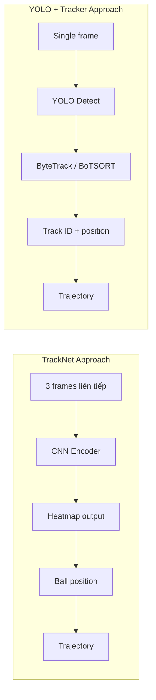
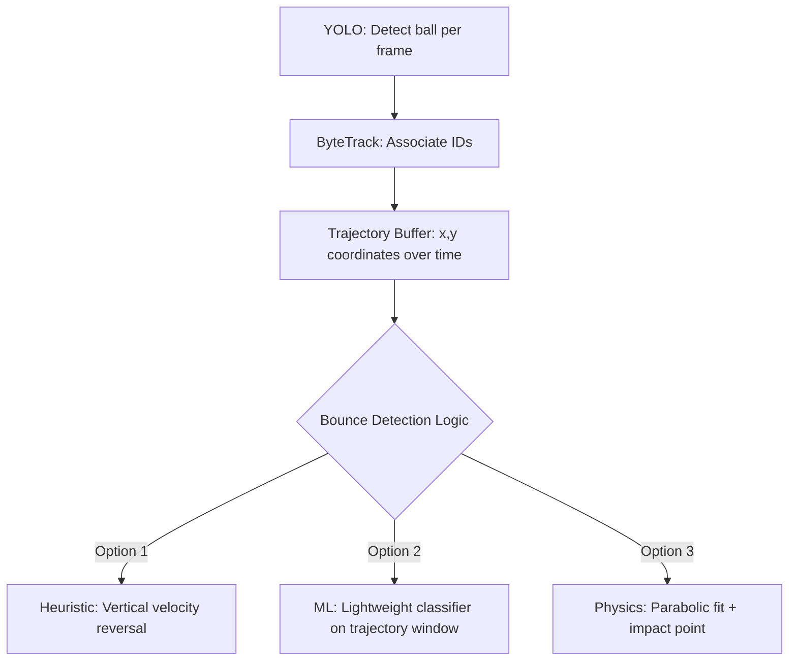
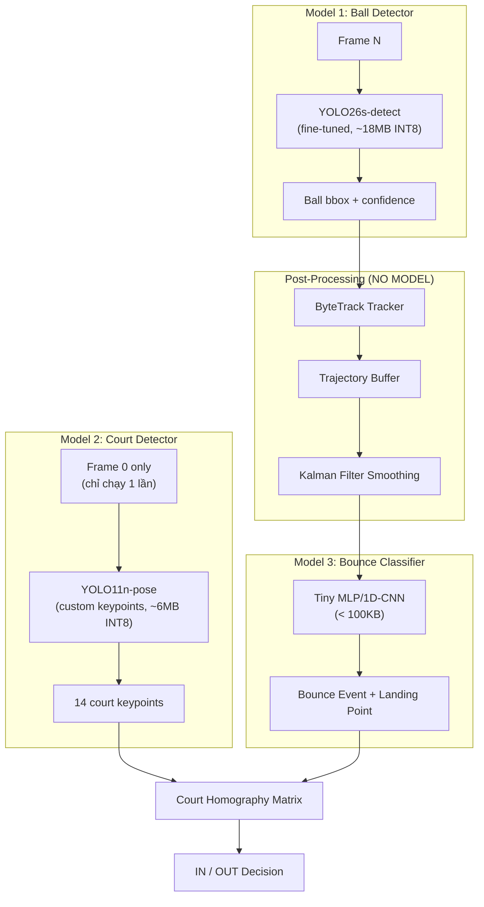

# YOLO Mobile Strategy - Trả lời 6 Câu hỏi cho HermiVision

---

## Câu 1: Model YOLO nào chạy TỐT NHẤT trên Cell Phone?

### Trả lời: **YOLO26n** (Nano) — mới nhất, thiết kế riêng cho edge

| Model | Params | GFLOPs | mAP50-95 (COCO) | CPU Inference | Mobile Suitability |
|-------|--------|--------|------------------|---------------|-------------------|
| YOLOv8n | 3.2M | 8.7 | 37.3 | Baseline | ✅ Tốt |
| **YOLO11n** | **2.6M** | **6.5** | **39.5** | Faster | ✅✅ Rất tốt |
| YOLO12n | ~2.6M | ~6.5 | ~40.6 | Slower (attention) | ⚠️ Chậm trên mobile CPU |
| **YOLO26n** 🚀 | ~2.6M | ~6.0 | ~40+ | **43% faster CPU** | ✅✅✅ Tốt nhất |

### Tại sao YOLO26 tốt nhất cho mobile?

1. **NMS-Free (End-to-End)**: Loại bỏ Non-Maximum Suppression — giảm phức tạp post-processing trên mobile
2. **Loại bỏ DFL (Distribution Focal Loss)**: Giảm graph complexity → dễ quantize INT8 hơn
3. **STAL (Small-Target-Aware Label Assignment)**: Cải thiện detect vật thể nhỏ (tennis ball/shuttlecock)
4. **ProgLoss**: Tối ưu cho small object detection
5. **CPU inference nhanh hơn 43%** so với versions trước

### Recommendation theo thứ tự ưu tiên:

```
1. YOLO26n (nano)  ← TỐT NHẤT, mới nhất, edge-first design
2. YOLO11n (nano)  ← Stable fallback, ecosystem trưởng thành hơn
3. YOLOv8n (nano)  ← Community lớn nhất, nhiều tutorial nhất
```

> [!IMPORTANT]
> **KHÔNG dùng YOLO12 cho mobile.** Architecture attention-centric (Area Attention, FlashAttention) chạy chậm trên mobile CPU/NPU do thiếu optimized kernel support.

### Deployment Strategy cho Snapdragon 8 Gen 2:

```
Export Pipeline:
  .pt → ONNX → TFLite INT8 (hoặc Qualcomm AI Hub cho Hexagon NPU)

Quantization:
  FP32 → INT8 (post-training quantization với calibration dataset)

Target Hardware:
  1. NPU (Hexagon) via QNN delegate ← nhanh nhất, tiết kiệm pin nhất
  2. GPU (Adreno) via TFLite GPU delegate ← backup
  3. CPU (Cortex-A) ← fallback
```

---

## Câu 2: Model YOLO nào fine-tune detect tennis ball / pickleball TỐT NHẤT?

### Trả lời: **YOLO11s** hoặc **YOLO26s** (Small variant)

> [!WARNING]
> Nano (n) tuy nhanh nhưng feature extraction yếu cho small objects. **Small (s) variant** là sweet spot tốt nhất giữa speed và accuracy cho ball detection.

### So sánh Nano vs Small cho fine-tuning:

| Variant | Params | GFLOPs | Small Object Detection | Mobile Speed |
|---------|--------|--------|----------------------|--------------|
| YOLO11n | 2.6M | 6.5 | ⚠️ Trung bình | Rất nhanh |
| **YOLO11s** | **9.4M** | **21.5** | **✅ Tốt** | **Nhanh** |
| YOLO11m | 20.1M | 68.0 | ✅✅ Rất tốt | Chậm trên mobile |

### Chiến lược Fine-tuning Tối ưu:

```yaml
# data.yaml
path: /path/to/dataset
train: train/images
val: valid/images

nc: 1                    # 1 class: "ball" (tennis + pickleball chung)
names:
  0: ball
```

```python
from ultralytics import YOLO

# Load pretrained model
model = YOLO('yolo11s.pt')     # hoặc 'yolo26s.pt'

# Fine-tune
results = model.train(
    data='ball_data.yaml',
    epochs=200,                 # Nhiều hơn repo tennis (100 epochs)
    imgsz=640,                  # Giữ 640, KHÔNG giảm xuống 320
    batch=16,
    device=0,
    # ===== QUAN TRỌNG cho small objects =====
    augment=True,
    mosaic=1.0,                 # Mosaic augmentation
    mixup=0.1,                  # MixUp augmentation
    scale=0.9,                  # Scale augmentation
    # ===== Optimizer =====
    optimizer='AdamW',
    lr0=0.001,
    # ===== Early stopping =====
    patience=30,
)
```

### Dataset Recommendations:

| Source | Dataset | Images | Notes |
|--------|---------|--------|-------|
| Roboflow | "tennis-ball-detection" (viren-dhanwani) v6 | ~530 | Yếu, cần bổ sung |
| Roboflow | Search "pickleball" | Varies | Cộng thêm |
| **Custom** | **Quay video thực tế từ app** | **500+** | **QUAN TRỌNG NHẤT** |
| Kaggle | "tennis ball images" | Varies | Bổ sung diversity |

> [!TIP]
> **Kết hợp nhiều dataset.** Repo tennis_analysis chỉ dùng ~530 images → Recall chỉ 52.5%. Bạn cần **ít nhất 2000+ images** với varied backgrounds, lighting, motion blur để đạt Recall > 80%.

### Tricks cho Small Object Detection:

1. **Giữ imgsz=640** — KHÔNG giảm resolution, vì ball đã rất nhỏ
2. **Train trên imgsz=1280** nếu GPU cho phép → sau đó inference trên mobile ở 640
3. **Sử dụng P6 variant** (`yolov5l6u` kiểu repo tennis) nếu accuracy > speed
4. **Custom anchor boxes**: Để YOLO autoanchor tự tính dựa trên size distribution
5. **Negative samples**: Thêm images không có ball để giảm false positives

---

## Câu 3: Có thể sử dụng thuật toán tracking của TrackNet cho YOLO không?

### Trả lời: **CÓ, nhưng phải chuyển đổi approach**

TrackNet và YOLO có tracking logic **khác biệt cơ bản**:



### YOLO Built-in Tracking (Ultralytics):

```python
from ultralytics import YOLO

model = YOLO("yolo11s_ball.pt")  # Fine-tuned model

# Built-in tracking — 1 dòng code
results = model.track(
    source="match_video.mp4",
    tracker="bytetrack.yaml",     # hoặc "botsort.yaml"
    persist=True,                  # Giữ track ID qua frames
    conf=0.25,                     # Confidence threshold
)
```

### So sánh 2 Tracker có sẵn:

| Feature | ByteTrack | BoTSORT |
|---------|-----------|---------|
| **Speed** | ⚡ Rất nhanh | Chậm hơn |
| **Re-ID (Appearance)** | ❌ Không | ✅ Có |
| **Camera Motion Compensation** | ❌ Không | ✅ Có |
| **Low-confidence rescue** | ✅ Có (điểm mạnh) | ✅ Có |
| **Use case tốt nhất** | Static camera, mobile | Broadcast footage |
| **Phù hợp cho HermiVision** | ✅✅ Recommended | ⚠️ Quá nặng cho mobile |

### Chuyển logic temporal tracking từ TrackNet sang YOLO:

TrackNet dùng **3 consecutive frames** làm input để tạo temporal context. Với YOLO, bạn simulate điều này bằng **post-processing trajectory analysis**:

```kotlin
// Kotlin pseudo-code cho Android
class BallTrajectoryAnalyzer {
    private val positionHistory = ArrayDeque<PointF>(maxSize = 30)  // 30 frames

    fun addDetection(ballPosition: PointF?, confidence: Float) {
        if (ballPosition != null && confidence > 0.25f) {
            positionHistory.addLast(ballPosition)
        }
    }

    // Interpolation khi miss frames (tương tự TrackNet temporal)
    fun interpolateMissing(): List<PointF> {
        // Kalman Filter hoặc Polynomial regression
        // để fill gaps khi YOLO miss detect 1-2 frames
    }

    // Smoothing trajectory (Savitzky-Golay filter)
    fun smoothTrajectory(): List<PointF> { ... }
}
```

> [!IMPORTANT]
> **Kết hợp YOLO detect + ByteTrack + Kalman Filter** có thể đạt trajectory tracking **tương đương** TrackNet trên mobile, mà KHÔNG bị memory leak vì mỗi frame xử lý độc lập.

---

## Câu 4: YOLO có thể fine-tune để thực hiện Bounce Detection không?

### Trả lời: **KHÔNG trực tiếp.** YOLO detect vật thể, KHÔNG detect sự kiện.

Bounce Detection là **temporal event detection** — cần hiểu trajectory theo thời gian. YOLO chỉ nhìn **1 frame tại 1 thời điểm**.

### Pipeline Bounce Detection với YOLO:



### Option 1: Heuristic (Đơn giản nhất, chạy trên mobile)

```kotlin
class BounceDetector {
    private val yHistory = mutableListOf<Float>()  // y positions
    private val WINDOW = 5  // 5 frames

    fun isBounce(currentY: Float): Boolean {
        yHistory.add(currentY)
        if (yHistory.size < WINDOW * 2 + 1) return false

        // Ball đang đi xuống → đột ngột đi lên = BOUNCE
        val beforeSlope = yHistory[WINDOW] - yHistory[0]        // Đi xuống (positive)
        val afterSlope = yHistory[WINDOW * 2] - yHistory[WINDOW] // Đi lên (negative)

        return beforeSlope > THRESHOLD && afterSlope < -THRESHOLD
    }
}
```

### Option 2: ML Classifier trên Trajectory (Tốt nhất)

```
Input:  Window of 21 (x,y) coordinates → shape [21, 2]
Model:  Tiny 1D-CNN hoặc MLP (< 50KB)
Output: Binary classification {bounce, no_bounce}
```

Train lightweight model riêng cho bounce detection:
- Input: 21-frame window of ball coordinates (từ YOLO detections)
- Output: Bounce probability
- Model size: < 100KB
- **Chạy thoải mái trên mobile CPU**

### Option 3: Physics-based (Chính xác nhất)

1. Fit parabolic curve cho trajectory
2. Xác định điểm tiếp đất (y ≈ court_surface_y)
3. Detect velocity reversal tại điểm đó
4. Yêu cầu court homography để chính xác

> [!TIP]
> **Recommendation**: Dùng **Option 2 (ML classifier)** — lightweight, accurate, dễ train. Input từ YOLO trajectory, output bounce event. Tổng < 100KB model size thêm.

---

## Câu 5: Chấp nhận trả phí, Model YOLO nào TỐT NHẤT?

### Trả lời: **YOLO26** (hoặc YOLO11) + Enterprise License từ Ultralytics

### Licensing:

| License | Cost | Requirements |
|---------|------|-------------|
| **AGPL-3.0** (Free) | $0 | Phải open-source TOÀN BỘ app code |
| **Enterprise** | ~$5,000-$20,000+/year (custom) | Closed-source OK, commercial use OK |

### Cách mua Enterprise License:
- **Email**: sales@ultralytics.com
- **Website**: https://www.ultralytics.com/license
- Pricing tùy thuộc vào: quy mô tổ chức, use case, mức support

### Enterprise License bao gồm:
- ✅ Quyền embed YOLO vào closed-source product
- ✅ Dedicated support & onboarding
- ✅ Enterprise-grade models
- ✅ SSO/SAML, role-based access
- ✅ Advanced deployment tools

### Model tốt nhất nếu paid:

```
Recommendation theo thứ tự:

1. YOLO26s (Small)  ← Tốt nhất overall cho ball detection + mobile
   - NMS-Free → giảm complexity
   - STAL → tốt cho small objects
   - Edge-optimized
   
2. YOLO11s (Small)  ← Stable, ecosystem trưởng thành
   - 9.4M params, 21.5 GFLOPs
   - COCO mAP50-95: 47.0
   
3. YOLO11m (Medium) ← Nếu phone flagship + offline processing
   - 20.1M params, 68.0 GFLOPs
   - COCO mAP50-95: 51.5
```

> [!WARNING]
> **Platform Plan ($29/month) ≠ Enterprise License.** Platform Plan chỉ là compute credits trên Ultralytics cloud. Enterprise License mới cho phép embed vào commercial app.

---

## Câu 6: Một model YOLO duy nhất có thể handle TẤT CẢ tasks không?

### Trả lời: **KHÔNG THỂ dùng 1 model duy nhất.** Cần multi-model pipeline.

### Tại sao không thể 1 model?

| Task | YOLO Task Type | Architecture Cần |
|------|---------------|-------------------|
| Ball Detection | Object Detection (`detect`) | `yolo11s.pt` |
| Court Detection | Keypoint Estimation (`pose`) | `yolo11s-pose.pt` (custom keypoints) |
| Ball Tracking | Post-processing (ByteTrack) | Không phải model |
| Bounce Detection | Temporal Event | Lightweight ML classifier riêng |

Mỗi task cần **different architecture head** — YOLO detect model output bounding boxes, YOLO pose model output keypoints. **Chúng KHÔNG thể chung 1 forward pass** cho custom tasks khác nhau.

### Pipeline Tối Ưu cho HermiVision:



### Recommended Package cho mỗi Task:

| Task | Model | Size (INT8) | Frequency | Runtime |
|------|-------|-------------|-----------|---------|
| **Ball Detection** | `YOLO26s` fine-tuned | ~18MB | Every frame | ONNX Runtime / TFLite |
| **Court Detection** | `YOLO11n-pose` custom | ~6MB | 1 lần (frame đầu) | ONNX Runtime / TFLite |
| **Ball Tracking** | ByteTrack (code, no model) | ~0KB | Every frame | Kotlin code |
| **Trajectory Smoothing** | Kalman Filter (code) | ~0KB | Every frame | Kotlin code |
| **Bounce Detection** | Tiny MLP classifier | ~100KB | Per trajectory window | ONNX Runtime |
| **IN/OUT** | Homography + geometry (code) | ~0KB | Per bounce event | Kotlin code |

### Tổng resources trên phone:

```
Total Model Size:  ~24MB (vs TrackNetV3 alone = ~50MB+)
Total Models:      3 (ball + court + bounce)
Total Code Logic:  ByteTrack + Kalman + Homography
Memory Footprint:  ~100MB working memory (vs TrackNetV3 = 500MB+)
```

---

## Tổng kết: Migration Plan từ TrackNetV3 → YOLO

```
TrackNetV3 (Python, memory leak on mobile)
         ↓ THAY THẾ BẰNG
┌─────────────────────────────────────────────┐
│  YOLO26s-detect (ball) + ByteTrack          │  ← Thay TrackNetV3
│  YOLO11n-pose (court keypoints)             │  ← Thay ResNet50
│  Tiny MLP (bounce classify)                 │  ← Thay BounceDetectorInferencer
│  Kotlin code (Kalman + homography + score)  │  ← Logic thuần code
└─────────────────────────────────────────────┘
```

### Lợi ích so với TrackNetV3:
- ✅ **Không memory leak** — YOLO xử lý single-frame, không giữ state nặng
- ✅ **Nhẹ hơn 5-10x** memory footprint
- ✅ **INT8 quantization** hoạt động tốt (CNN-based, không phải attention)
- ✅ **Snapdragon NPU support** tốt hơn (CNN operations fully supported)
- ✅ **Modular** — mỗi component thay thế độc lập
- ⚠️ **Trade-off**: Single-frame detect accuracy thấp hơn multi-frame TrackNet khi ball rất nhỏ/motion blur nặng → bù bằng ByteTrack + Kalman smoothing
